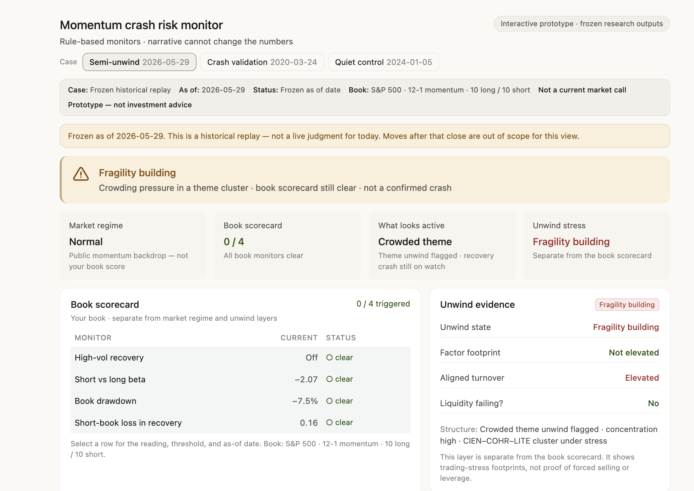

<p align="center">
  <a href="docs/methodology.md"></a>
  <a href="docs/demo_walkthrough.md"></a>
  <a href="notebooks/final_mvp_demo.ipynb"></a>
  <a href="#limitations"></a>
</p>

# Momentum Crash Monitor

**An AI-assisted monitoring workflow that try to help PM recognize a fragile momentum setup, locate the risk in the book, and provide grounded interpretation with evidence before acting.**

The prototype answers six questions:

1. **What is the momentum outlook today/selected day? Do we have any momentum tail risk?**
2. **Where is the risk: the long leg, short leg, or a concentrated cluster? Quantify them**
3. **Does the setup resemble a recovery-driven momentum crash or a crowded unwind?**
4. **Which signals are active, incomplete, or absent?**
5. **What timestamp-valid evidence supports or contradicts the read?**
6. **What happened in the historic momentum crash? 2020,2007,2024**

```text
Quant Metrics Monitoring → PM book risk  →  mechanism read(DM vs KL)  
→  LLM-based evidence challenge  →  next checks
```

This is a research MVP. It does **not** predict an exact crash date, produce a crash probability, optimize a portfolio, or issue a trade instruction.

---

## PM workflow prototype

Interactive prototype of how frozen research outputs can enter an auditable PM workflow. Snapshot below shows the Semi-unwind case (as of 2026-05-29) — not a live market call.

<p align="center">
  
</p>

Open [`docs/figures/dashboard_mockup.html`](docs/figures/dashboard_mockup.html) in a browser (offline, no build step). Switch cases, drill into scorecard rows, and use the inspect-next actions.

Prototype only · frozen research outputs · not production investment advice.

---

## Momentum-crash logic

A momentum portfolio is generally long recent winners and short recent losers. It can become fragile through two different mechanisms.

### 1. Recovery-driven momentum crash

In a bear market, recent winners may become relatively defensive, while recent losers are often distressed, cyclical, or higher beta.

```text
Severe market drawdown
        ↓
Winners become relatively defensive
Losers become distressed / high beta
        ↓
Fast market recovery
        ↓
Losers rebound faster than winners
        ↓
The short leg loses heavily
        ↓
Momentum reverses sharply
```

This is the Daniel–Moskowitz mechanism.

The dangerous condition is not simply “the market is rising.” It is a **deep prior drawdown followed by a rapid recovery, strong loser rebound, and short-leg pain**.

The monitor therefore checks:

- market drawdown and recovery state;
- realized volatility;
- long-versus-short beta;
- short-leg losses;
- portfolio drawdown;
- breadth of the loser-stock rebound.

### 2. Crowded-position unwind

Momentum can also become fragile when similar portfolios own the same winners, short the same losers, or concentrate in the same themes.

```text
Concentrated positions / narrow breadth / shared themes
        ↓
Similar investors reduce exposure
        ↓
One-sided selling or short covering
        ↓
Weak liquidity absorption
        ↓
Correlated losses propagate across books
```

This is the Khandani–Lo mechanism.

Crowding is treated as a **risk amplifier**, not proof of forced deleveraging. The system only escalates the interpretation when concentration, correlated selling, weak absorption, and supporting positioning evidence begin to line up.

---

## What the system monitors

| PM question | Current monitor | Interpretation |
|---|---|---|
| Is the market in a dangerous recovery state? | Prior drawdown, volatility, recovery speed, UMD context | Recovery crashes are state-dependent |
| Is the short leg vulnerable? | Short-leg return, loser rebound, short-versus-long beta | The short basket may behave like a high-beta recovery trade |
| Is the book concentrated? | HHI, effective number of bets, theme clusters | Fewer independent bets increase correlated-exit risk |
| Is momentum becoming narrow? | Signal breadth across the universe | A narrow trade is easier to crowd and reverse |
| Is weakness spreading? | Correlated selloff, turnover and absorption proxies | Separates local pressure from broader propagation |
| Does outside evidence agree? | Timestamped news and public positioning context | Supports, contradicts, or leaves the mechanism unconfirmed |

The outputs remain separate and auditable. They are **not merged into one opaque risk score**.

---

## One PM decision workflow

```text
1. Locate the pressure
   Long leg, short leg, market regime, or concentrated theme?

2. Identify the mechanism
   Recovery reversal, crowded unwind, or ordinary noise?

3. Challenge the read
   What supports it? What contradicts it? What is still missing?

4. Choose the next check
   Maintain monitoring, inspect exposures, request better positioning data,
   or discuss whether risk escalation deserves review.
```

The PM book is the primary object. Ken French UMD and the Daniel–Moskowitz market state provide **historical context only**; they are never treated as the PM book’s risk score or loss probability.

---

## Product demo

Open [`notebooks/final_mvp_demo.ipynb`](notebooks/final_mvp_demo.ipynb).

The `CONFIG` cell near the top is the PM sandbox: change its assessment date,
comparison date, horizon, or LLM flag and run all cells to recompute the live
assessment. The semiconductor, March 2020, January 2024, and cross-case sections
are explicitly labeled frozen product packs and do not change with `CONFIG`.

The recommended review order is:

1. **Latest available semiconductor case (frozen 2026-05-29 assessment)**
2. **March 2020 historical validation**
3. **January 2024 quiet control**

### Current Semi Unwind case Lookback— 2026-05-29

> The evidence supports localized crowding and structural pressure, but does not confirm a broad recovery-driven momentum crash or forced deleveraging.

| PM question | Current read |
|---|---|
| Where is the risk? | Concentrated and correlated long-side semiconductor exposure |
| Recovery-crash mechanism? | Weak / incomplete |
| Crowded-unwind mechanism? | Partially supported |
| What is not confirmed? | Broad propagation, liquidity failure, forced deleveraging |
| What next? | Monitor breadth, selling propagation, absorption, and stronger positioning evidence |

Full case: [`outputs/current_semi_unwind/pm_case_read.md`](outputs/current_semi_unwind/pm_case_read.md)

### Historical validation — 2020-03-24 Covid

A known reversal episode produces a coherent recovery-crash footprint:

- severe prior market drawdown;
- panic-elevated state;
- rapid recovery;
- short-leg and beta-gap pressure;
- recovery-crash mechanism triggered.

This is an interpretability check: the implemented signals behave consistently with the economic mechanism during a known episode.

Full case: [`outputs/march_2020_reference/pm_case_read.md`](outputs/march_2020_reference/pm_case_read.md)

### Quiet control — 2024-01-05

The same rules produce no escalation:

- soft bear / low-volatility context;
- zero PM scorecard triggers;
- no confirmed crowded unwind;
- recovery mechanism incomplete.

This shows that the framework does not classify every weak momentum period as a crash setup.

Full case: [`outputs/quiet_control_2024/pm_case_read.md`](outputs/quiet_control_2024/pm_case_read.md)

---

## Portfolio construction

The default demo book is an equal-weight S&P 500 **12-1 momentum long-10 / short-10** portfolio.

**Heads up:** Currently this is a proxy-like test portfolio, not a recommendation that an institutional momentum strategy should hold only 20 names.

A production quant portfolio would more commonly:

- rank a larger investable universe;
- use percentile or decile to construct universe;
- hold many more names:either hold the universe and adjust weight or L/S basket
- neutralize market, industry, size, country, and other factor exposures;
- apply liquidity, borrow, turnover, and risk constraints;
- optimize weights rather than use equal weighting.

The MVP uses L10/S10 because every name, weight, cluster, and source of P&L can be inspected during a short demo.

```text
Current demo:
S&P 500 → 12-1 rank → top 10 / bottom 10 → equal weight

Intended future production path:
PM universe → momentum signal → percentile selection
→ risk neutralization → portfolio constraints
→ optimized weights → same monitoring framework
```

The monitoring layer is designed to accept a different universe, portfolio size, and weight vector later.

---

## Beta logic

Beta is not a fixed company attribute. It depends on the estimation window, return frequency, market regime, outliers, and risk model.

The MVP uses a transparent historical realized market beta for each stock and aggregates it using portfolio weights.

Its purpose is narrow:

> **Does the short basket behave materially more like a high-beta recovery trade than the long basket?**

That comparison maps directly to the recovery-crash mechanism. It is not intended to replace a production risk model or prove that the portfolio is factor neutral.

Because raw historical beta can be unstable, a production version should use robust outlier treatment, shrinkage, multi-factor exposures, actual PM weights, and a formal portfolio-neutralization process.

---

## Crowding logic

Crowding is monitored as a chain rather than a single number:

```text
Concentration
+ narrow breadth
+ shared clusters
+ one-sided flow
+ weak liquidity absorption
= greater unwind risk
```

| Channel | Current MVP | Stronger production input |
|---|---|---|
| Concentration | HHI and effective number of bets | Actual PM and cross-manager holdings |
| Breadth / clustering | Signal breadth and correlated themes | Prime-broker position overlap |
| Short crowding | Public short-interest context where available | Borrow utilization and stock-loan cost |
| Flow | Turnover and timestamped narrative context | Leveraged ETF positions, retail flow, and institutional flows |
| Liquidity | Absorption and price-impact-style proxies | Order-book and market-impact data |
| Options | TBD| Options positioning and dealer gamma |
| Financing | TBD | Leverage, margin, and financing pressure |

Public proxies identify where crowding may be plausible. They cannot confirm true ownership overlap, leverage, or forced selling.

---

## System design

```text
                         ┌──────────── MVPConfig ────────────┐
                         │ as_of · compare_to · horizon · LLM │
                         └────────────────┬──────────────────┘
                                          │
                                          ▼
                                   run_mvp()  ◄── single entry
                                          │
            ┌─────────────────────────────┼─────────────────────────────┐
            │                             │                             │
            ▼                             ▼                             ▼
   ┌────────────────┐          ┌──────────────────┐          ┌───────────────────┐
   │ UMD / DM       │          │ PM momentum book │          │ Unwind +          │
   │ comparison     │          │ (S&P 10/10 demo) │          │ crowding monitor  │
   │────────────────│          │──────────────────│          │───────────────────│
   │ market state   │          │ leg attribution  │          │ recovery reversal │
   │ panic / bear   │          │ beta comparison  │          │ concentration     │
   │ UMD context    │          │ bounded triggers │          │ breadth / spread  │
   └───────┬────────┘          └────────┬─────────┘          └─────────┬─────────┘
           │                            │                              │
           └────────────────────────────┴──────────────────────────────┘
                                          │
                                          ▼
                              Deterministic risk read
                                          │
                           ┌──────────────┴──────────────┐
                           ▼                             ▼
                 exact-date evidence            optional constrained
                 replay and retrieval           LLM interpretation
                           └──────────────┬──────────────┘
                                          ▼
                               PM-facing evidence card
                                          │
                                          ▼
                               charts · JSON · Markdown
```

### Design principles

1. **PM book first.** UMD is context, not a substitute for the actual portfolio.
2. **Mechanisms stay separate.** Recovery risk and crowded unwind are not collapsed into one score.
3. **AI cannot change the numbers.** It organizes and challenges evidence only.
4. **Missing evidence stays missing.** Ownership, leverage, and forced selling are not inferred without data. NO HALLUCINATIONS.
5. **Point-in-time discipline.** Features and evidence must have been available by the selected date.

```text
deterministic metrics
        ↓
mechanism interpretation
        ↓
timestamp-valid evidence
        ↓
    LLM summary

The LLM cannot rewrite:
metric | threshold | trigger | risk state
```

---

## Quick start

Requirements: Python **3.11–3.14** and [`uv`](https://docs.astral.sh/uv/).

```bash
uv sync --locked --all-groups
uv run python -m src.mvp.demo_smoke_test
uv run python -m pytest -q
```

Open the notebook:

```bash
uv run --with jupyterlab jupyter lab notebooks/final_mvp_demo.ipynb
```

Run the pipeline:

```python
from src.mvp.config import MVPConfig
from src.mvp.pipeline import run_mvp

config = MVPConfig(
    as_of_date="2024-01-05",
    compare_to_date="2023-12-01",
    threshold_profile="default",
    horizon_days=20,
    use_llm=False,
)

result = run_mvp(config)
```

---

## Repository map

```text
momentum_crash/
├── README.md
├── Future_To_DO.md
├── docs/
│   ├── methodology.md
│   ├── limitations.md
│   ├── demo_walkthrough.md
│   └── architecture_to_value.md
├── notebooks/
│   └── final_mvp_demo.ipynb
├── src/
│   ├── mvp/                     # configuration, pipeline, PM presentation
│   ├── monitoring/              # scorecard and unwind logic
│   ├── portfolio/               # portfolio construction
│   ├── regime/                  # market-state classification
│   ├── risk/                    # beta and leg decomposition
│   ├── evidence/                # timestamped evidence and optional LLM
│   ├── features/
│   ├── data/
│   └── utils/
├── tests/
├── data/processed/
└── outputs/
    ├── current_semi_unwind/
    ├── march_2020_reference/
    ├── quiet_control_2024/
    ├── cross_case_comparison.md
    └── research_validation/
```

---

## Limitations

The current repository does **not** yet provide:

- a percentile-based, fully optimized and factor-neutral institutional portfolio;
- actual PM holdings, weights, constraints, or transaction costs;
- a production multi-factor vendor risk model;
- complete point-in-time index and industry membership;
- direct institutional ownership, prime-broker overlap, leverage, or financing data;
- ETF, retail, options, dealer-gamma, and order-book flow data;
- proof of forced deleveraging;
- a full out-of-sample predictive backtest of the mechanism rules.

Historical cases test whether the mechanism read is economically coherent. They do not establish a crash forecast.

See [`docs/limitations.md`](docs/limitations.md) for the full list.

---

## Production extensions

The most useful next steps are:

1. plug in actual PM holdings, weights, and constraints;
2. replace L10/S10 with percentile-based, risk-neutralized construction;
3. add point-in-time universe and industry history;
4. add robust multi-factor risk exposures;
5. add institutional holdings, borrow, ETF flow, options, dealer gamma, and liquidity data;
6. persist daily mechanism states for out-of-sample outcome analysis;
7. extend the same framework to industry, country, and index-futures momentum.

For industry momentum, the same workflow would rank point-in-time industry portfolios, neutralize market and industry-level risks, and monitor beta asymmetry, breadth, crowding, and reversal. Country or index momentum would use liquid index futures or ETFs with explicit controls for global equity beta, region, currency, and futures rolls.

See [`Future_To_DO.md`](Future_To_DO.md) for the broader roadmap.

---

## References

1. **Daniel, K., & Moskowitz, T. J. (2016).** *Momentum Crashes.*  
   Recovery-driven momentum-crash mechanism.

2. **Khandani, A. E., & Lo, A. W. (2007; 2011).** *What Happened to the Quants in August 2007?*  
   Crowded-position and quant-unwind mechanism.

3. **Ken French Data Library.**  
   UMD and market-factor data used as published comparison context.
