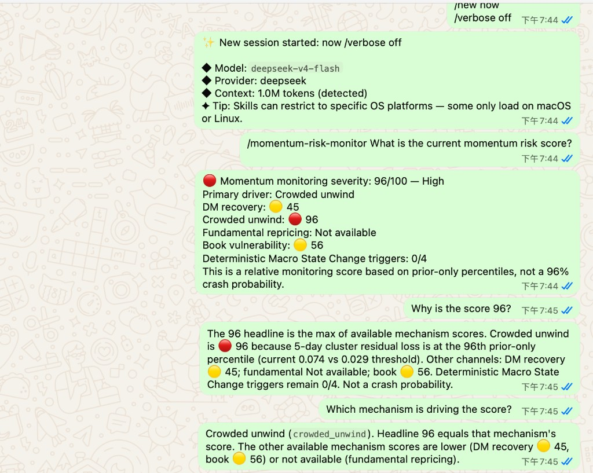
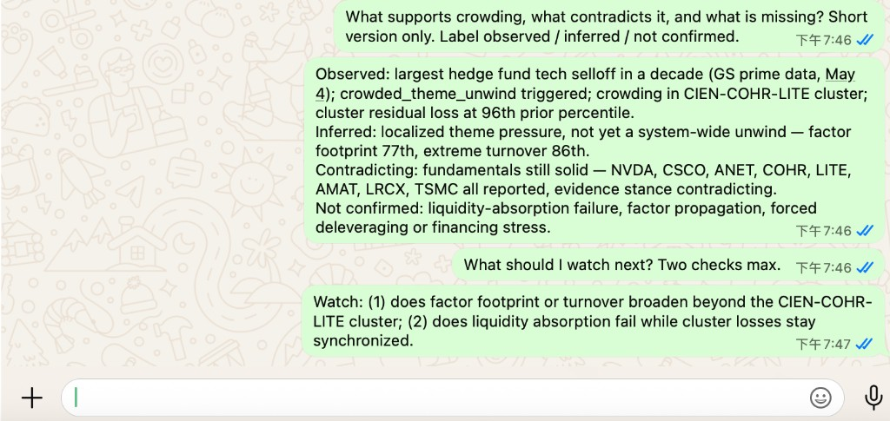

# Hermes + WhatsApp POC

Thin integration around the existing deterministic momentum tail-risk monitor. Hermes does not recalculate triggers. The Baileys WhatsApp bridge is **unofficial**; prefer a dedicated number, not a personal account.

Do not commit credentials, phone numbers, API keys, QR sessions, or anything under `~/.hermes/`.

## Quick setup and run

From this repository root:

```bash
uv sync --locked --all-groups
uv run python scripts/run_monitor.py \
  --as-of-date 2026-05-29 \
  --evidence-cutoff "2026-05-29 16:00 ET" \
  --output-json outputs/latest_assessment.json

mkdir -p ~/.hermes/skills
ln -sfn "$(pwd)/integrations/hermes/momentum-risk-monitor" \
  ~/.hermes/skills/momentum-risk-monitor
```

Hide tool bubbles in `~/.hermes/config.yaml` (quote `"off"`), then start the gateway **without** `-v`:

```bash
hermes gateway setup    # WhatsApp QR
hermes gateway run
```

In WhatsApp:

```text
/verbose off
/sethome
/new now
/momentum-risk-monitor Why is this not a Khandani–Lo unwind? Short version only.
```

The follow-up should be seven short lines. `book n/4` is `deterministic_trigger_count` (frozen case: **0/4**). If the chat still dumps source-code progress, the skill symlink is pointing at the wrong folder or an old auto-created skill is winning — relink to this repo and send `/new now`.

Demo questions after that: Daniel–Moskowitz short version; crowding evidence short version; next two checks; “Should I cut the longs overnight?” (must refuse a trade).

---

## 1. Install and validate Hermes

Follow the current [Hermes Agent install](https://hermes-agent.nousresearch.com/docs/getting-started/installation). Then:

```bash
hermes doctor
hermes model
```

Confirm the terminal tool is enabled so the agent can run this repository's CLI.

## 2. Install the repository skill

From the clone of this repository:

```bash
mkdir -p ~/.hermes/skills
ln -sfn "$(pwd)/integrations/hermes/momentum-risk-monitor" \
  ~/.hermes/skills/momentum-risk-monitor
```

Copy instead of symlink if you do not want live updates from git:

```bash
cp -R integrations/hermes/momentum-risk-monitor ~/.hermes/skills/momentum-risk-monitor
```

Validate:

```bash
hermes skills list | grep momentum-risk-monitor
```

The working directory for monitor commands is this repository root (`uv sync --locked` if the environment is not already installed).

## 3. Run the monitor manually through Hermes

In the Hermes CLI (or after WhatsApp is connected):

```text
/momentum-risk-monitor Run the momentum risk monitor for the configured assessment date.
```

Or, without slash-loading, ask:

```text
Run the momentum risk monitor using the momentum-risk-monitor skill.
```

Frozen demo date used in this POC:

```bash
python scripts/run_monitor.py \
  --as-of-date 2026-05-29 \
  --evidence-cutoff "2026-05-29 16:00 ET" \
  --output-json outputs/latest_assessment.json

python scripts/compare_monitor_state.py \
  --current outputs/latest_assessment.json \
  --previous runtime_state/previous_assessment.json \
  --output-json outputs/latest_comparison.json
```

The first compare creates a baseline and prints `[SILENT]`. A second unchanged compare also prints `[SILENT]`. Integer moves inside the same severity band are not alerts.

Ask WhatsApp: `What is the current momentum risk score?` Hermes must copy `monitoring_severity_score` from the JSON (emoji + label + 0–100), not invent a probability.

## 4. Configure the Hermes WhatsApp Baileys bridge

This POC uses the unofficial Baileys WhatsApp Web bridge, **not** Meta WhatsApp Business Cloud API.

```bash
hermes gateway setup
```

Pick WhatsApp when prompted. Equivalent direct command:

```bash
hermes whatsapp
```

Scan the QR code from a **dedicated** WhatsApp number (Settings → Linked Devices). Session files stay in `~/.hermes/platforms/whatsapp/session` on the local machine. Do not copy them into this repository.

Then set access control in `~/.hermes/.env` (local only): `WHATSAPP_ENABLED=true`, a mode (`bot` or `self-chat`), and an allowlist. See the [Hermes WhatsApp docs](https://hermes-agent.nousresearch.com/docs/user-guide/messaging/whatsapp).

## 4b. Hide tool-progress noise on WhatsApp

Hermes will otherwise post `read_file` / `execute_code` / `search_files` bubbles into the chat. That is a **local gateway display setting**, not this repository.

In the WhatsApp thread, send:

```text
/verbose off
```

And in `~/.hermes/config.yaml` (quote `"off"`; a bare `off` is parsed as boolean false and ignored):

```yaml
display:
  tool_progress: "off"
  show_reasoning: false
  platforms:
    whatsapp:
      tool_progress: "off"
      show_reasoning: false
      streaming: false

whatsapp:
  reply_prefix: ""
```

Restart the gateway:

```bash
hermes gateway
```

If this repo skill is installed via symlink, pull the latest `SKILL.md` so follow-ups read `outputs/latest_assessment.json` instead of grepping `src/`.

## 5. Start the Hermes gateway

```bash
hermes gateway
```

Optional user service: `hermes gateway install`. The gateway delivers chat replies and cron results to the configured WhatsApp destination.

## 6. Send a WhatsApp request

From the allowlisted number:

```text
Run the momentum risk monitor for the configured assessment date.
```

Follow-up example (same thread, so Hermes can reuse the latest JSON):

```text
Why is this not a Khandani–Lo unwind?
```

## 7. Daily post-close brief (weekday cron)

After the 16:00 ET close, one CLI runs the existing monitor and compare. Stdout is `[SILENT]`, the two-message WhatsApp alert, or a stale-data notice. This is not a new model: same score, same discrete compare, push only on a material change. Integer drift inside the same band stays silent. Stale panels (older than a weekend/holiday gap) are **not** treated as a quiet day.

```bash
python scripts/run_daily_brief.py            # last completed US close, if data are fresh
python scripts/run_daily_brief.py --demo     # frozen 2026-05-29
```

Do not add a separate scheduler. Hermes cron already delivers to the gateway. Example weekday job after the 16:00 ET cutoff; adjust the expression for the **host timezone**:

```text
hermes cron create "30 16 * * 1-5" --skill momentum-risk-monitor --deliver whatsapp --name "Momentum daily brief"
```

Use this prompt (the job runs in a fresh session):

```text
Run the monitor using the momentum-risk-monitor skill.
Run only python scripts/run_daily_brief.py from the repository root.
Send stdout only. If stdout is [SILENT], reply exactly [SILENT].
Otherwise send stdout as-is. Do not investigate, rewrite scores, or print JSON.
```

`[SILENT]` suppresses WhatsApp delivery. Failed runs still deliver. With the bundled processed panels ending 2026-06-30, a live run after that date prints `Data through 2026-06-30, not the YYYY-MM-DD close. Not a daily brief.` Use `--demo` for the frozen case.

To **download** French / VIX / S&P prices and rebuild the book (does **not** invent UMD or make `run_mvp` work past the last French date):

```bash
python scripts/refresh_data.py
```

That command downloads through the last completed 16:00 ET close. It does not list local vintages. Pass `--as-of-date YYYY-MM-DD` only for a named date. `--dry-run` inspects existing panels and skips download.

If French is still short of the requested date after the download, stdout says so and the process exits 2. Do not commit raw Yahoo/SSGA caches.

## 8. Using `[SILENT]`

The comparison layer treats these as non-alerts:

- no previous state (initial baseline);
- unchanged `risk_state` / posture, trigger set, structural flags, mechanism/evidence IDs, severity band, and primary driver.

Small numeric moves that do not cross a threshold or severity band are ignored. Hermes must return exactly `[SILENT]` in those cases.

## Manual smoke test (WhatsApp QR is not automated)

1. `python scripts/run_daily_brief.py --demo` → `[SILENT]` (baseline)
2. Repeat step 1 → `[SILENT]`
3. Pair WhatsApp locally with `hermes gateway setup` / `hermes whatsapp` (phone required)
4. Send the monitor request from the allowlisted chat
5. Confirm a silent tick produces no WhatsApp message, and a material change produces only the short alert

## Live WhatsApp test (2026-05-29)

Frozen-case score card and crowding follow-up from the Hermes WhatsApp skill:





